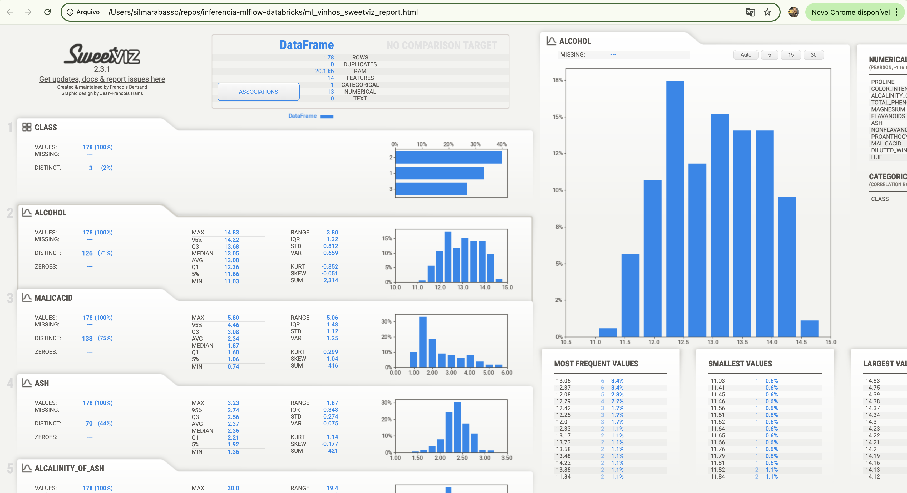

# inferencia-mlflow-databricks
Neste projeto pratiquei o deploy e Inferência de Modelos de Machine Learning com MLflow e Databricks

# Classificação de Vinhos por caracteristicas

fonte dos dados:
https://archive.ics.uci.edu/ml/machine-learning-databases/wine/wine.data

## Análise Exploratória (EDA, Exploratory Data Analysis) 

ml_vinhos_sweetviz_report.html

